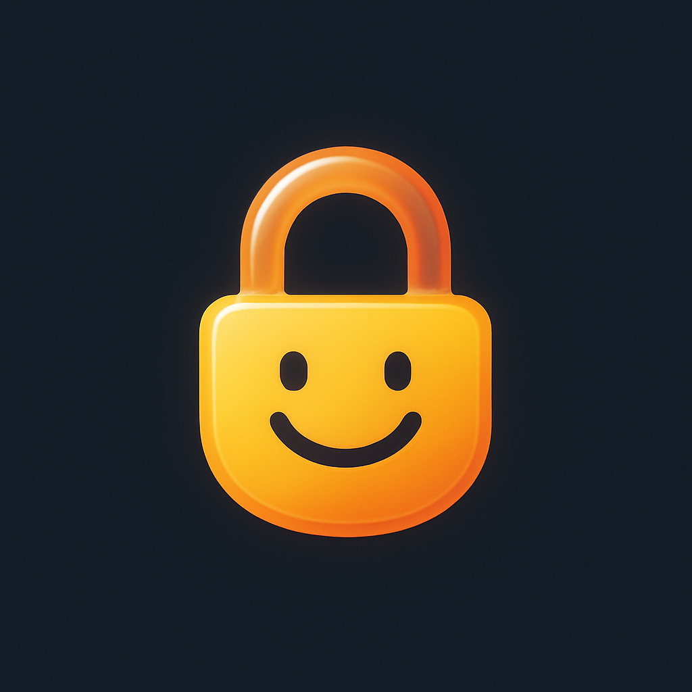

# KidLock 🔒

<div align="center">
  
  
  **A parental control app for Android TV that helps manage screen time for children**
  
  [](LICENSE)
  [](https://www.android.com/tv/)
  [](https://kotlinlang.org/)
</div>

---

## 📖 About

**KidLock** is an Android TV application designed to help parents manage their children's screen time effectively. As a parent myself, I understand the challenges of balancing technology use with healthy development. Digital wellbeing is crucial in today's world, and I believe every family should have access to tools that help create a healthier relationship with screens.

That's why I'm making KidLock **open source and freely available to everyone**. This app is my contribution to helping families navigate the digital age together.

## ✨ Features

- **⏱️ Screen Time Management**: Set daily time limits for TV usage
- **🔐 Secure Access Control**: 6-digit PIN protection for admin settings
- **🚫 Automatic Blocking**: Apps are automatically blocked when time limits are reached
- **🎯 Android TV Optimized**: Designed specifically for TV interfaces and remote controls
- **🔄 Boot Persistence**: Continues monitoring after device restarts
- **👨‍👩‍👧 Parent-Friendly**: Simple admin panel for easy configuration

## 🛠️ Technical Details

### Built With

- **Language**: Kotlin
- **Minimum SDK**: Android 7.0 (API 24)
- **Target SDK**: Android 14 (API 34)
- **Architecture**: MVVM (Model-View-ViewModel)
- **Key Technologies**:
  - AndroidX Core & AppCompat
  - Material Design Components
  - Lifecycle ViewModel & LiveData
  - Kotlin Coroutines
  - Android Leanback Library (TV support)
  - Accessibility Service API
  - Usage Stats API

### Key Components

1. **MainActivity**: Main entry point and dashboard
2. **AdminActivity**: Secure admin panel for configuration
3. **PinInputActivity**: PIN authentication screen
4. **ScreenTimeAccessibilityService**: Background service for app monitoring and blocking
5. **DataRepository**: Centralized data management
6. **AppSettings**: Persistent settings storage

## 🚀 Getting Started

### Prerequisites

- Android TV device or emulator running Android 7.0 or higher
- Android Studio (for building from source)

### Installation (from source)

1. Clone the repository:
   ```bash
   git clone https://github.com/yanmasharski/kidlock-tv.git
   cd kidlock-tv
   ```

2. Open the project in Android Studio

3. Build and run on your Android TV device or emulator

### Installation (from APK)

If you just want to install the app without building it yourself, you can use the prebuilt APK:

1. Locate the release APK in this repository at `app/release/app-release.apk`
2. Copy the APK to your Android TV device (for example via USB drive, network share, or `adb`)
3. On your Android TV, enable installation from unknown sources in system settings (if not already enabled)
4. Open the APK on your TV (e.g. with a file manager) and confirm the installation
5. Once installed, you will find **KidLock** in your apps list on Android TV

### First-Time Setup

1. Launch KidLock on your Android TV
2. Grant required permissions:
   - **Accessibility Service**: Required for app blocking functionality
   - **Usage Stats**: Required for tracking app usage time
3. Set up your admin PIN (6 digits)
4. Configure time limits and access codes

## 🔒 Permissions

KidLock requires the following permissions:

- **BIND_ACCESSIBILITY_SERVICE**: To detect when apps are launched and block them when necessary
- **PACKAGE_USAGE_STATS**: To monitor how long apps have been used
- **RECEIVE_BOOT_COMPLETED**: To restart monitoring after device reboots

These permissions are essential for the app to function properly and are used solely for parental control purposes.

## 🎯 How It Works

1. **Set Time Limits**: Configure daily screen time limits through the admin panel
2. **Monitor Usage**: KidLock tracks app usage in the background using Android's Accessibility Service
3. **Automatic Blocking**: When the time limit is reached, KidLock automatically blocks access to apps
4. **Access Codes**: Generate temporary access codes to grant additional time when needed
5. **Admin Control**: Parents can access settings and override blocks using the secure PIN

## 🤝 Contributing

Contributions are welcome! Whether you're fixing bugs, adding features, or improving documentation, your help makes KidLock better for everyone.

1. Fork the repository
2. Create your feature branch (`git checkout -b feature/AmazingFeature`)
3. Commit your changes (`git commit -m 'Add some AmazingFeature'`)
4. Push to the branch (`git push origin feature/AmazingFeature`)
5. Open a Pull Request

## 📝 License

This project is licensed under the GNU Affero General Public License v3.0 (AGPL v3) - see the [LICENSE](LICENSE) file for details.

## 💬 Support & Feedback

If you encounter any issues or have suggestions for improvement, please [open an issue](https://github.com/yanmasharski/kidlock-tv/issues) on GitHub.

## 🌟 Why Open Source?

As a parent, I care deeply about digital wellbeing and believe that healthy screen time habits are essential for children's development. By making KidLock open source, I hope to:

- Make parental control tools accessible to everyone, regardless of budget
- Foster a community of parents and developers working together
- Ensure transparency in how the app works and what data it accesses
- Enable customization for different family needs
- Contribute to the broader conversation about digital wellbeing

**Digital wellbeing shouldn't be a luxury—it should be available to all families.**

---

<div align="center">
  Made with ❤️ by a parent who cares about digital wellbeing
  
  **If KidLock helps your family, please consider giving it a ⭐ on GitHub!**
</div>
